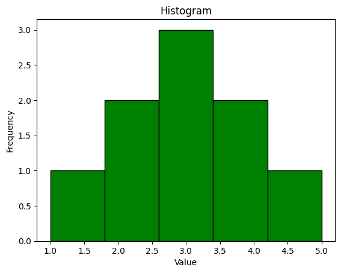
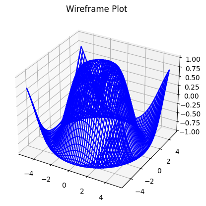

# Visualization Library Documentation

This guide provides an overview of two popular Python visualization libraries, Matplotlib and Plotly. It explores the variety of graphs they can generate and includes practical examples with code snippets. The document also compares the strengths and weaknesses of these libraries to help users choose the right tool for their needs.

## Table of content
1. [Visualization Library](#visualization-library-documentation)
2. [Matplotlib](#matplotlib)
    1. [Introduction](#matplotlib)
    2. [Type's of Graph](#types-of-graph-offered-by-matplotlib)
3. [Plotly](#plotly)
    1. [Introduction]()
    2. [Type's of Graph]()
4. [Comparison](#comparison)

---------------------------

# 📊Matplotlib

Matplotlib is a Python library that allows users to create data visualizations, including static, animated, and interactive plot.

Matplotlib was created by John D. Hunter. It's open source and can be used freely. 

Matplotlib Library are available as wheel packages for macOS, Windows and Linux for python, we can install it using ```pip```<br>

```sh
pip install matplotlib
``` 
### pyplot


The library’s primary plotting tool is the ```pyplot``` module, It is a collection of functions that make matplotlib work like MATLAB.

Way to use MatPlotlib's pyplot module in Python 
```py
import matplotlib.pyplot as plt
```
### figure

The figure is the top-level container of all the axes and properties of a plot, or we can say that it is a canvas that holds the drawings (graphs or plots) on it. 

The ```pyplot``` module has a **figure()** function in it. We can create a new figure by using this function.

## Type's of Graph offered by Matplotlib

### 1. Line Graph
__Description__: A basic plot that connects data points with a line. <br>
**Use Case**: Visualizing trends over time.

__Code Snippet:__
```py
# line plot

# X axis parameter:
xaxis = np.array([2, 5, 8,])
# Y axis parameter:
yaxis = np.array([4, 6, 7])
plt.plot(xaxis, yaxis)
plt.xlabel('year after 201x')
plt.ylabel('sales in Cr.')
plt.show()
```
__Output:__


### 2. Bar Chart
__Description__: Represents data using rectangular bars. <br>
**Use Case**: omparing discrete categories.

__Code Snippet:__
```py
# bar chart

Shop = ['A', 'B', 'C', 'D']
values = [4, 7, 1, 8]

plt.bar(Shop, values, color='blue')
plt.title('Bar Chart')
plt.xlabel('Shop')
plt.ylabel('Sales in lakhs')
plt.show()
```
__Output:__


### 3. Scatter Plot
__Description__: Displays data points as dots. <br>
**Use Case**: Identifying relationships or clusters in data.

__Code Snippet:__
```py
# scatter plot

x = [1, 2, 3, 4, 5]
y = [5, 3, 8, 1, 7]

plt.scatter(x, y, color='red')
plt.title('Scatter Plot')
plt.xlabel('X-axis')
plt.ylabel('Y-axis')
plt.show()
```
__Output:__


### 4. Area Chart
__Description__: Displays quantitative data graphically by plotting data points and shading the area below the line. <br>
**Use Case**: Visualizing cumulative trends.

__Code Snippet:__
```py
# area Chart

x = [1, 2, 3, 4, 5]
y = [2, 3, 5, 7, 11]

plt.fill_between(x, y, color="skyblue", alpha=0.4)
plt.plot(x, y, color="Slateblue", alpha=0.7, linewidth=2)
plt.title('Area Plot')
plt.xlabel('X-axis')
plt.ylabel('Y-axis')
plt.show()
```

__Output:__


### 5. Histogram
__Description__: Shows the distribution of a dataset. <br>
**Use Case**: Analyzing frequency distributions.

__Code Snippet:__
```py
# histogram 

data = [1, 2, 2, 3, 3, 3, 4, 4, 5]

plt.hist(data, bins=5, color='green', edgecolor='black')
plt.title('Histogram')
plt.xlabel('Value')
plt.ylabel('Frequency')
plt.show()
```

__Output:__



### 6. Box Plot
__Description__: Displays the distribution of data based on a five-number summary. <br>
**Use Case**: Identifying outliers and understanding data spread.

__Code Snippet:__
```py
# box plot

data = [7, 8, 5, 6, 9, 10, 5, 6, 7]

plt.boxplot(data)
plt.title('Box Plot')
plt.ylabel('Values')
plt.show()
```
__Output:__


### 7. Pie Chart
__Description__: Displays data as proportions of a whole. <br>
**Use Case**: Showing percentage contributions.

__Code Snippet:__

```py
# pie chart

labels = ['team A', 'team B', 'team C', 'team D']
values = [15, 30, 45, 10]

plt.pie(values, labels=labels, autopct='%1.0f%%', startangle=90)
plt.title('Team Performance Pie Chart')
plt.show()
```

__Output:__


### 8. Violin Plot
__Description__: Combines aspects of a box plot and a density plot.  <br>
**Use Case**: Visualizing data distribution and probability density.

__Code Snippet:__
```py
# violin plot

plt.style.use('_mpl-gallery')

# make data:
np.random.seed(10)
D = np.random.normal((3, 5, 4), (0.75, 1.00, 0.75), (200, 3))

# plot:
fig, ax = plt.subplots()

vp = ax.violinplot(D, [2, 4, 6], widths=2,
                   showmeans=False, showmedians=False, showextrema=False)
# styling:
for body in vp['bodies']:
    body.set_alpha(0.9)
ax.set(xlim=(0, 8), xticks=np.arange(1, 8),
       ylim=(0, 8), yticks=np.arange(1, 8))

plt.show()
```
__Output:__


## 3D plots
### 1. 3D Bar Graph
__Description__: Displays data as 3D bars in a three-dimensional space. <br>
**Use Case**: Comparing categorical data in three dimensions.

__Code Snippet:__
```py
# 3d bar chart

fig = plt.figure()
ax = fig.add_subplot(111, projection='3d')
x = [1, 2, 3, 4, 5]
y = [2, 3, 4, 5, 6]
z = np.zeros(len(x))
dx = dy = 0.5
dz = [5, 10, 15, 20, 25]

ax.bar3d(x, y, z, dx, dy, dz, color='cyan', alpha=0.7)
ax.set_title('3D Bar Chart')
plt.show()
```

__Output:__


### 2. 3D Scatter Graph 
__Description__: Displays data points in a three-dimensional space.<br>
**Use Case**: Visualizing spatial relationships in datasets.

__Code Snippet:__
```py
# 3D scatter plot 

fig = plt.figure()
ax = fig.add_subplot(111, projection='3d')

x = [1, 2, 3, 4, 5, 4, 6, 3, 7, 3, 5, 2, 9]
y = [5, 3, 8, 1, 7, 3, 6, 7, 4, 3, 6, 2, 6]
z = [2, 4, 6, 8, 10, 2, 6, 8, 3, 6, 2, 6, 8]

ax.scatter(x, y, z, color='red')
ax.set_title('3D Scatter Plot')
plt.show()
```

__Output:__


### 3. Surface Graph
__Description__: Represents a 3D surface defined by a grid of data points. <br>
**Use Case**: Visualizing functions of two variables.

__Code Snippet:__
```py
# Surface plot

fig = plt.figure()
ax = fig.add_subplot(111, projection='3d')

x = np.linspace(-5, 5, 50)
y = np.linspace(-5, 5, 50)
x, y = np.meshgrid(x, y)
z = np.sin(np.sqrt(x**2 + y**2))

ax.plot_surface(x, y, z, cmap='viridis', edgecolor='none')
ax.set_title('Surface Plot')
plt.show()
```

__Output:__


### 4. Wireframe Graph
__Description__: A skeletal representation of a 3D surface. <br>
**Use Case**: Analyzing structural outlines in data.

__Code Snippet:__
```py
# wireframe plot 

fig = plt.figure()
ax = fig.add_subplot(111, projection='3d')

x = np.linspace(-5, 5, 50)
y = np.linspace(-5, 5, 50)
x, y = np.meshgrid(x, y)
z = np.sin(np.sqrt(x**2 + y**2))

ax.plot_wireframe(x, y, z, color='blue')
ax.set_title('Wireframe Plot')
plt.show()
```
__Output:__




# 📈plotly

Plotly is a modern visualization library that excels in creating interactive and web-based plots. Its user-friendly API and extensive interactivity make it a popular choice for dashboards and presentations.

Plotly offers interactive and web-ready visualizations that make it ideal for dynamic and engaging presentations. It seamlessly integrates with Dash, allowing users to create web applications effortlessly. The library also supports advanced visualizations, including 3D plots, and provides an easy mechanism to export plots to HTML for embedding in web pages.

### graph
> examples
>>A DESCRIPTION, ITS USE CASE, AND A CODE SNIPPET
1.
2.
3.
4.
5.


## Comparison

Matplotlib 

Pros- 

Data visualization is a key step in data analysis. It allows users to understand data trends and solve business problems more efficiently.

Cons- 


- strengths
- weaknesses